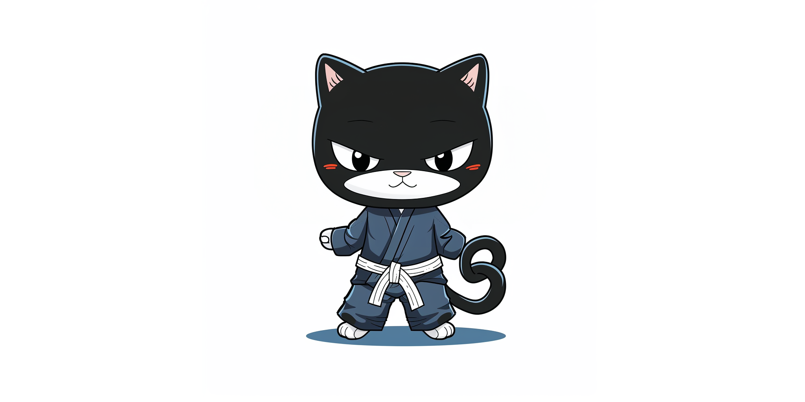

# Brazilian Jiu-Jitsu

This repository contians notes and recipes on techniques and principles in Brazilian Jiu-Jitsu.

## Contents
### General
- [BJJ in the Abstract](philosophy.md)
- [Frames](frames.md)

### Positions
- [Guard Bottom](guard_bottom.md)
- [Guard Retention](guard_retention.md)
- [Mount](mount.md)
- [Side Control](side_control.md)
- [Side Control Escapes](side_control_escapes.md)
